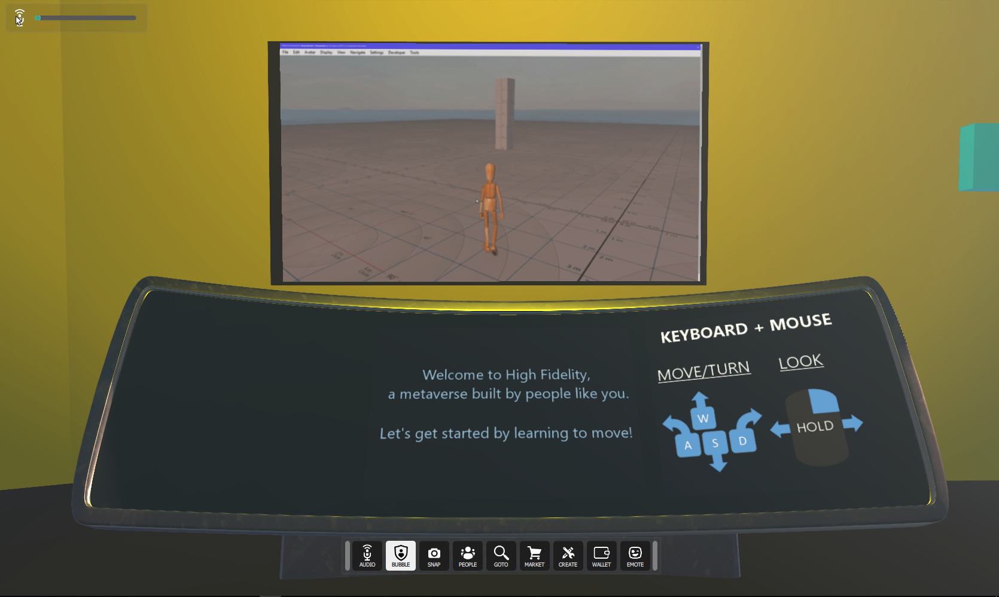
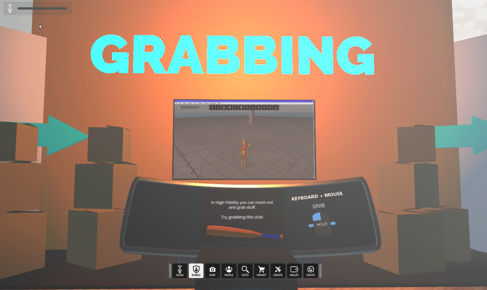
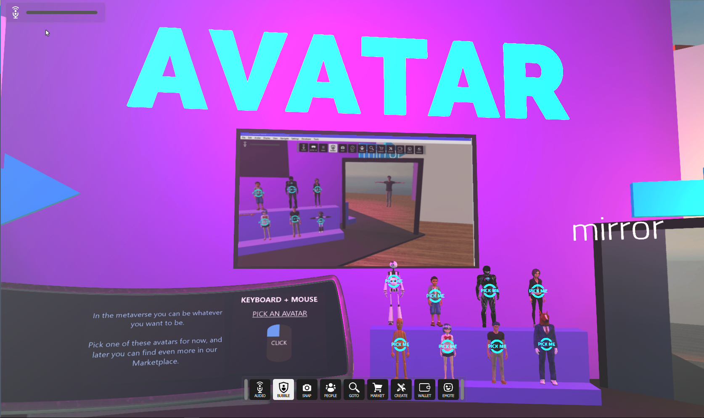
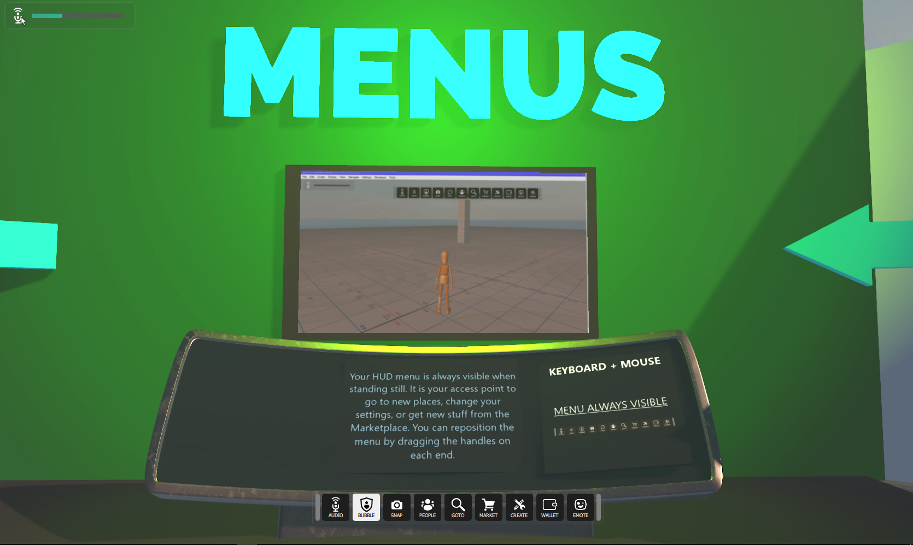
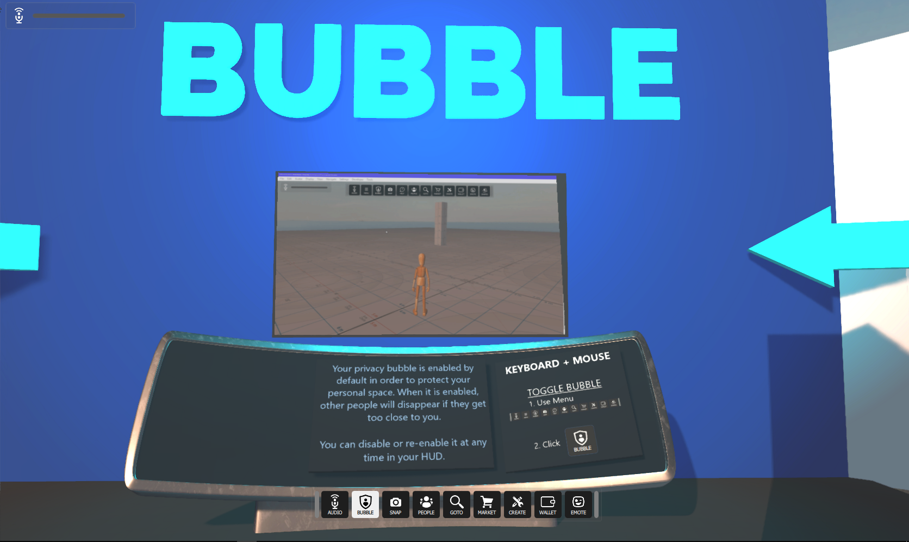
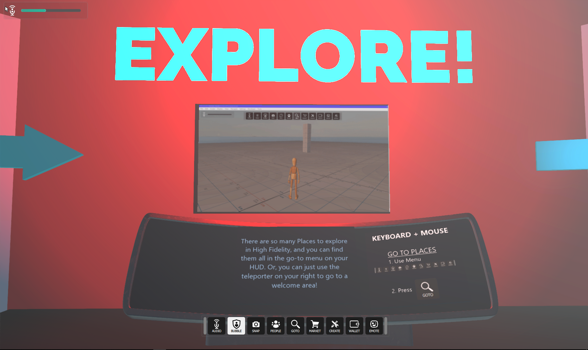
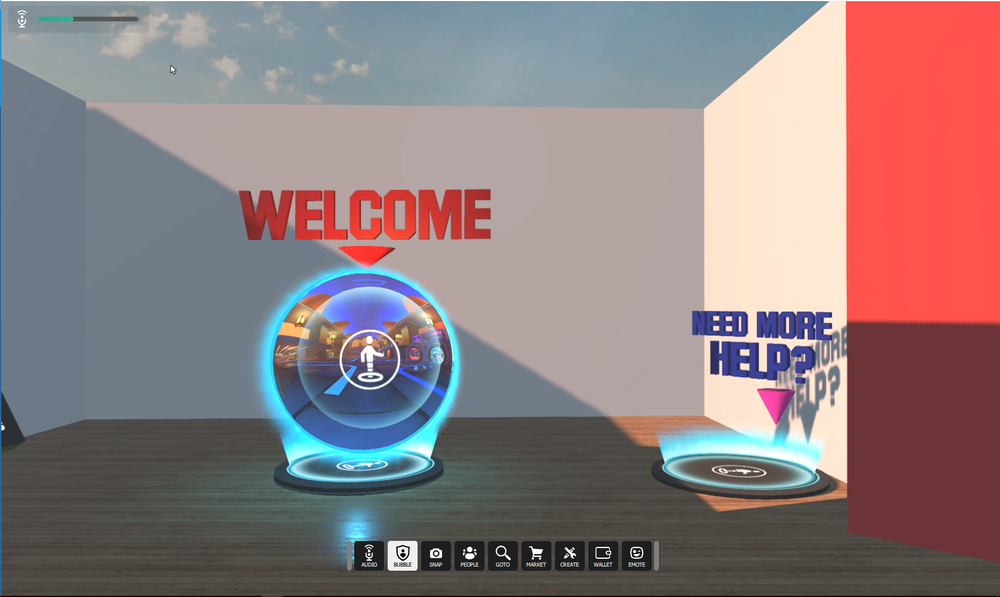
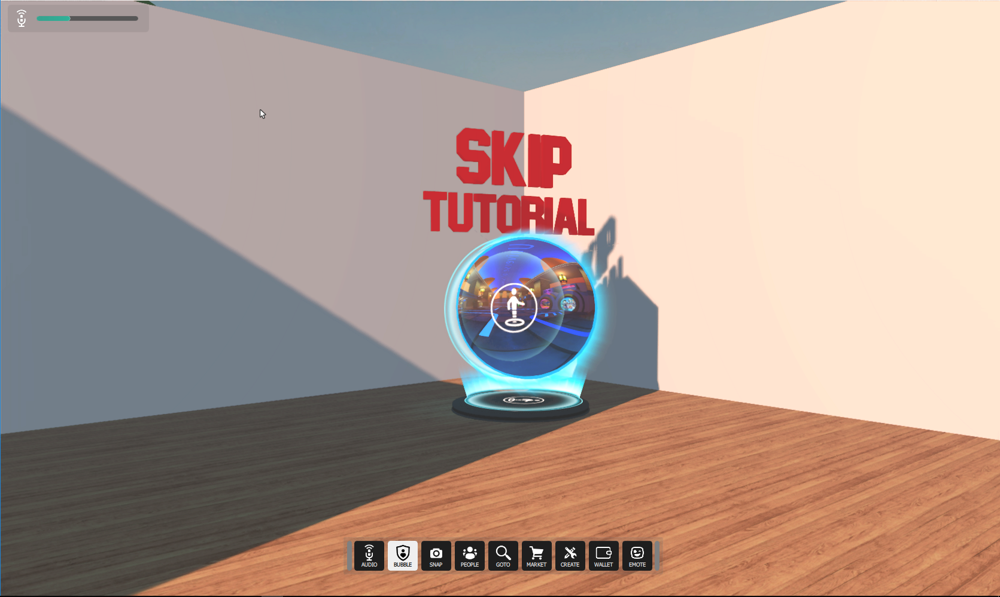

The **Interface** is our client. This means that when you launch Interface, you can explore VR worlds created in High Fidelity and interact with other users. You can visit VR worlds, meet people, attend events and even go for a class on avatar creation. It's an immersive and interactive experience with realistic visuals and audio.

You will start your High Fidelity journey in a tutorial space on your home domain. From here, you can familiarize yourself with all of the controls and features of High Fidelity. Each section has a helpful video walkthrough and audio directions on each feature.

When you are finished and ready to move on, walk through the Welcome portal to be taken to The Spot

If you have already been through the tutorial or otherwise do not want to complete it, feel free to skip it by walking through the portal behind you.

Check out all you need to know about the tablet and other tools in High Fidelity on the next page. 
