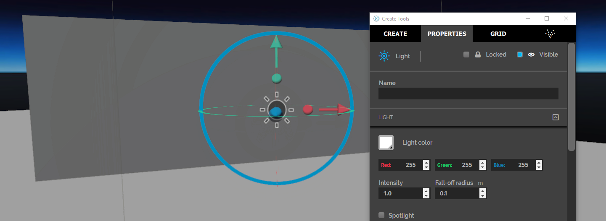
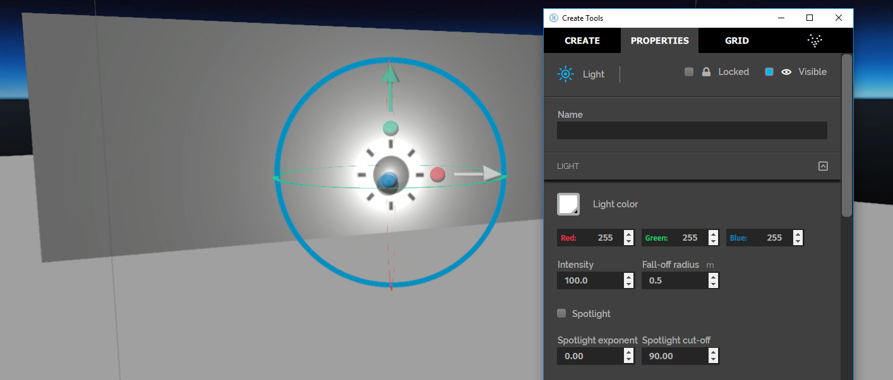
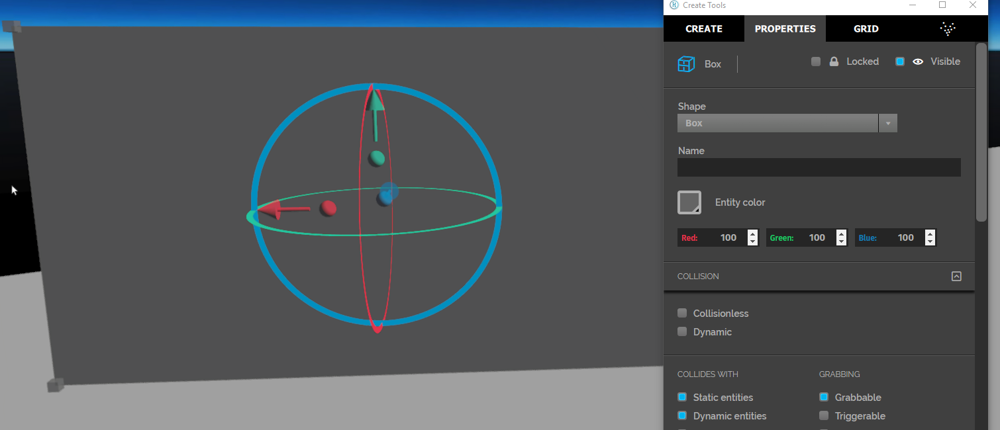
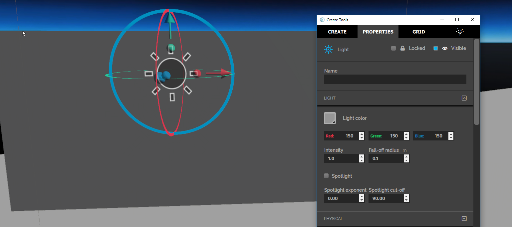
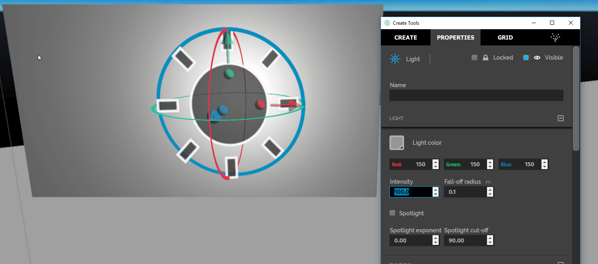
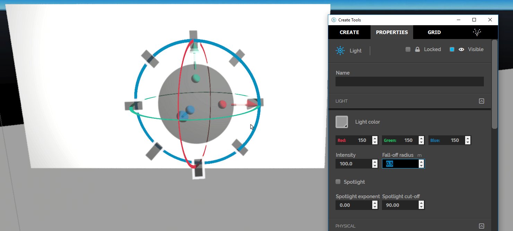
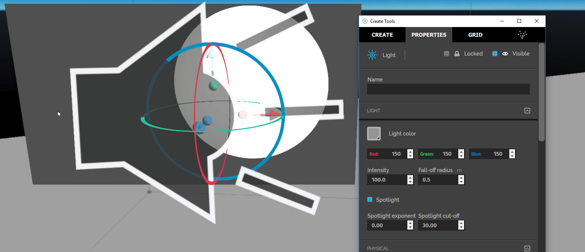
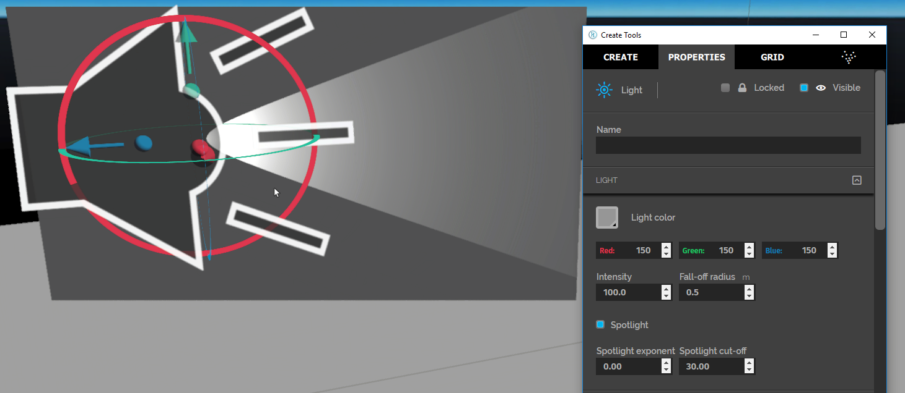

*Learn how to create and edit a light entity.*

## Overview

The Light entity works like a ball or a beam of light. It can be used to add local lighting effects or spotlights to an area. This page covers the basics of light entities.

## Create Light Entities

Go to **Create** and click on the Light icon to create a light entity.

A Light entity appears as an orange spherical grid. If you don't see the orange lines, you may need to select the entity and reposition yourself to see the entire entity.

You won't see any light unless there is an entity to reflect the light. In the image below, the Light entity has been edited to increase the intensity and has been positioned so that the light will reflect off a Box entity.

By default, Light entities cannot be selected for editing nor will they be visible to select.

## Example: Shine a Pink Spotlight on a Wall

To demonstrate how Light entities work this example creates a pink spotlight shining down a wall. For this example, you will need to:

1. Create a wall to shine the light on.
2. Create a Light entity.
3. Edit the Light properties so that it is a pink spotlight.

The next sections cover these steps in detail followed by a section covering some of the issues you might run into when working with Light entities.

### Create a Wall to Shine the Light On

To create a wall to shine the light on, in [Create Mode](../create-mode), complete these steps:

1. Click the **Cube** icon to [create a Box entity](../box-and-sphere-entities).
2. Use the multicolored balls to shape the **Cube** into a large flat wall.

### Create a Light Entity

To create a Light entity, complete these steps:

1. Ensure that selecting of Light entities is enabled.
2. Click the **Light** icon to create a light.
3. Grab the Light entity and move it so that it is centered on the wall.
   
   You'll notice that you don't see any light. This is because the radius of the light is too small and the brightness is too low.
4. In the Properties tab, scroll down to the Light properties to change the Intensity to 100. The intensity is the brightness 100of the light - a higher intensity corresponds with a brighter light. You should see the spot brighten up.
   
5. Change the Fall-off radius to 0.5. The Fall-off radius defines the shape of the light curve of a light. A larger radius will simulate a larger light, which will "falloff", or dim, more gradually. Specifically, it is the distance from the light at which the intensity is reduced by 25%. You should see the light radius increase.
   

This type of light is a point light and it emanates in all directions equally. It is meant for general area lighting as it has a bright point in the middle and fades as it radiates out.

### Edit the Light Properties to a Pink Spotlight

To edit the Light to be a pink spotlight, complete these steps:

1. Scroll down to the *Light* properties, click the box for **Spotlight**.
2. Change the Spotlight cut-off to 30. This property determines the radius of the spotlight. A higher cut-off value corresponds with a larger spotlight radius. You should see the beam tighten up to a smaller beam.
   
3. Rotate the Spotlight to better expose the next several changes.
   
3. Change the Spotlight exponent to 20. This property affects the softness of the beam. You should see the edge of the beam soften.
   
   You can experiment with different exponent, cutoff, and intensity combinations for varied effects.
4. Change the Light color to pink by adjusting the color values to Red: 255, Green: 0 , Blue 255.
   
5. Adjust the light's Rotation so that the spotlight is facing down the wall. A spotlight positioned like this can be used for a good effect over paintings or wall hangings in your world.
   

### Issues

The domain sun shines from one side, so one side of the wall is already bright. Light from the Light entity won't show up on the bright side of the wall.

## Video Overview of Light Entities

> > > > > This video was made with an earlier version of Interface, so you might notice differences in the tablet or HUD.

[plugin:youtube](https://www.youtube.com/watch?v=by1nsM9f-QI)
