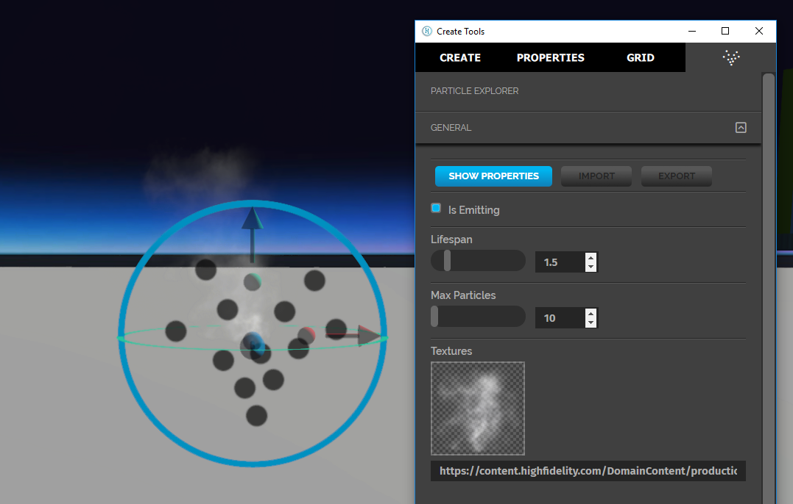
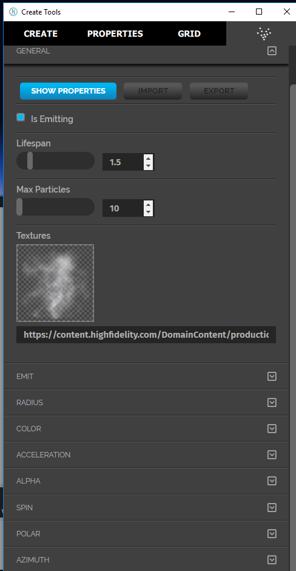
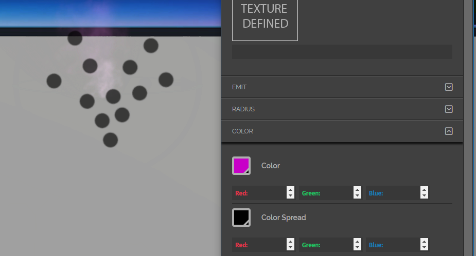

*Create and edit particle entities.*

## Overview

Particle entities are used to create effects made up of many small parts, such as fire, smoke, or falling leaves. We'll walk you through creating and editing a particle entity.

## Create a Particle Entity

Go to **Create** and select the Particle icon.

A particle entity first appears as a fountain of small white particles.

## Properties

Particle entities have the properties common to all entities as well as additional particle specific properties.

When you create or select a Particle entity, you can edit these properties from the Particle menu.

>>>>> The **Color** property appears in both, the **Properties** tab and the **Particle Explorer** tab. This is the same property. But, when you change the value in one tab, the value isn’t updated in the other. it is reflected in both places only once you select another entity and then re-select the particle entity.

Below is an image of a particle entity with a different color.

