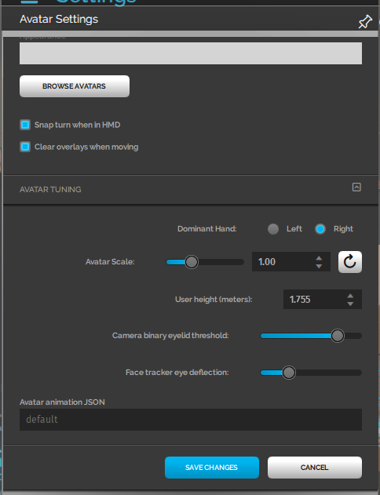

By default, avatars in High Fidelity will use the built in standard set of animations.  However, these animations are generic and masculine, which doesn't always fit the character of some avatars, such as dainty ballerinas or cartoon foxes.  It is possible to modify the avatar animations by inserting new animations to replace existing ones.  Additionally, advanced technical animators can adjust the animation state machine and the interpolation and blend parameters for truly unique avatars.
Here are some guidelines for creating animations in the proper format:
+ Animations must have the High Fidelity standard joint names
+ Animations must have the High Fidelity standard joint orientations (y down the bone) 
+ Keyframes must have keyframes for every joint at the uniform interval of 30 frames per second.

See [this document](https://docs.highfidelity.com/create-and-explore/avatars/avatar-standards) for more information about our avatar standards. 

### Modifying Avatar Animations

This document lists several ways to modify the avatar animations, from the easiest but least flexible, to the hardest but most flexible approach. 

#### Override Animation (Script)

The script call [MyAvatar.overrideAnimation](https://docs.highfidelity.com/api-reference/namespaces/myavatar#.overrideAnimation) can be used to play any animation on the current avatar.  It will smoothly interpolate from the avatar's current pose into the start frame of the provided animation.
If the animation is hosted remotely, you can use [AnimationCache.prefetch](https://docs.highfidelity.com/api-reference/namespaces/animationcache#.prefetch) to ensure that the animation is in-memory before playback. Otherwise you might see a few frames of t-pose as the animation is downloaded from the remote source.
This animation will take complete control over all the avatars joints.  Inverse Kinematics of the hands and head for HMD users will be disabled.
[MyAvatar.restoreAnimation](https://docs.highfidelity.com/api-reference/namespaces/myavatar#.restoreAnimation) can be used to stop the override animation and restore the avatar to its normal set of animations.

#### Override Role Animation (Script)

The default animation state machine has a list of specific animations or  that can be overridden.  The  Roles MyAvatar.getAnimationRoles() script call can be used to get the list of roles for the current avatar.   Each one of these roles can be replaced by a custom animation via the MyAv call.atar.overrideRoleAnimation
Here is the current list of roles followed by a brief description.
+ rightHandGraspOpen - When hand controller trigger is not squeezed.
+ rightHandGraspClosed - When hand controller trigger is fully squeezed.
+ rightIndexPointOpen - Point gesture.
+ rightIndexPointClosed - Point gesture with trigger squeezed.
+ rightThumbRaiseOpen - Thumbs up gesture.
+ rightThumbRaiseClosed - Thumbs up gesture with trigger squeezed.
+ rightIndexPointAndThumbRaiseOpen - Simultaneous thumbs up and point gesture.
+ rightIndexPointAndThumbRaiseClosed - Simultaneous thumbs up and point gesture, with trigger squeezed.
+ leftHandGraspOpen - When hand controller trigger is not squeezed.
+ leftHandGraspClosed - When hand controller trigger is fully squeezed.
+ leftIndexPointOpen - Point gesture.
+ leftIndexPointClosed - Point gesture with trigger squeezed.
+ leftThumbRaiseOpen - Thumbs up gesture.
+ leftThumbRaiseClosed - Thumbs up gesture with trigger squeezed.
+ leftIndexPointAndThumbRaiseOpen - Simultaneous thumbs up and point gesture.
+ leftIndexPointAndThumbRaiseClosed - Simultaneous thumbs up and point gesture, with trigger squeezed.
+ idleStand - Standing still, not talking.
+ idleTalk - Standing still, but avatar is talking.
+ walkFwdShort - walking forward at 0.5 m/s.
+ walkFwdNormal - walking forward at 1.5 m/s.
+ walkFwdRun - walking forward at 4.5 m/s.
+ idleToWalkFwd - short transition from standing idle to walking forward.
+ walkBwdShort - walking backward at 0.6 m/s.
+ walkBwdNormal - walking backward at 1.45 m/s.
+ turnLeft - standing turning in place animation.
+ turnRight - standing turning in place animation.
+ strafeLeftShort - sidestep at 0.2 m/s.
+ strafeLeftNormal - sidestep at 0.65 m/s.
+ strafeRightShort - sidestep at 0.2 m/s.
+ strafeRightNormal - sidestep at 0.65 m/s.
+ fly - flying idle.
+ takeoffStand - standing jump takeoff.
+ takeoffRun - running jump takeoff.
+ inAirStandPreApex - standing jump in air on the way upward towards the jump apex.
+ inAirStandApex - standing jump in air at apex of the jump.
+ inAirStandPostApex - standing jump in air on the downward arc of the jump.
+ inAirRunPreApex - running jump in air on the way upward towards the jump apex.
+ inAirRunApex- running jump in air at apex of the jump.
+ inAirRunPostApex - running jump in air on the downward arc of the jump.
+ landStandImpact - standing land.
+ landStand - standing land.
+ landRun - running land.

The standard animation FBX files for these roles can be found in the High Fidelity source code repository on [github](https://github.com/highfidelity/hifi/tree/master/interface/resources/avatar/animations).

#### Custom Animation Graph JSON

When wearing an avatar in High Fidelity, the animation system must blend and layer a series of animations from FBX files as well as perform Inverse Kinematics on the joints to best match the head and hand sensors. The way these animations are blended is not hard coded, but rather a data file specifies exactly which animations to play and how they are blended. It also determines the order of operations, such that operations like Inverse Kinematics occur after the rest of the body has been animated by traditional means. By default, every avatar uses the same Animation Graph file. However, advanced users and content creators can specify their own Anim Graph definition file.
This file is in the JSON file and it contains a hierarchical tree of nodes similar to Natural Motion's Morpheme or Unity's Mecanim.
The specific contents of this file are not yet documented, but will be soon. However, a content creator can perform a simple change by substituting the FBX urls with their own custom animations.
For reference here is the current default [avatar-animation.json](https://github.com/highfidelity/hifi/blob/master/interface/resources/avatar/avatar-animation.json) file. 
In the Settings > Avatar dialog the Avatar animation JSON field can be used to change the animation graph of the current avatar. 
Secondly, a animGraphUrl entry can be added to a specific avatar's FST file.  For example:
    animGraphUrl = https://s3.amazonaws.com/hifi-public/tony/scoot-animation.json
The above scoot-animtion.json file replaces the idle and walk animations with a sitting pose. It is intended to show an example of replacing some but not all of an avatar's default animations.